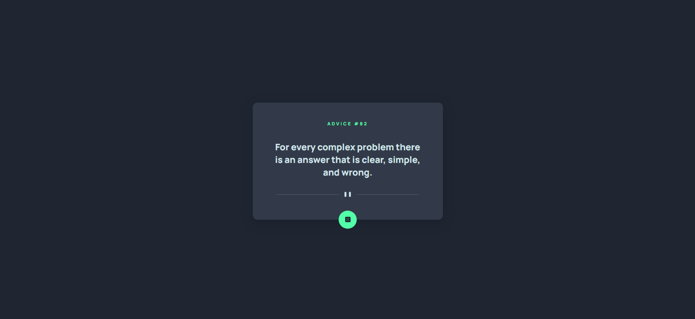
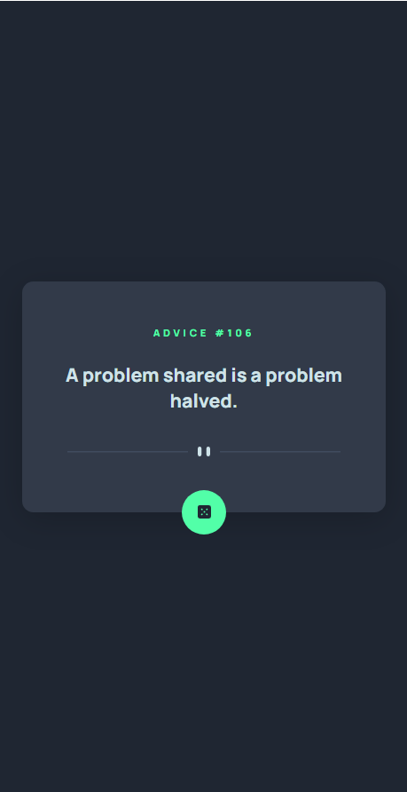

# Gerador de Conselhos App
## 📒 Descrição
O projeto foi baseado em um desafio do Frontend Mentor, o qual consiste em um Gerador de Conselhos usando HTML, CSS e Javascript, além de consumir uma API. 
 
Esse desafio foi proposto na conclusão do módulo de Javascript Avançado do curso DevQuest do Dev em Dobro.

## 🧠 Tecnologias Utilizadas
- HTML
- CSS
- Javascript
## 📊 Aprendizado
- Consumo de API;
- Requisições com fetch;
- Promises;
- Funções assíncronas com Async e Await;
- JSON;
- Template Strings.
## 🎯Lnks Úteis
- Frontend Mentor: https://www.frontendmentor.io/challenges/advice-generator-app-QdUG-13db
- API: https://api.adviceslip.com/
- Repositório: https://github.com/lucashtml6/app-gerador-de-conselhos/
- GitHub Pages: https://lucashtml6.github.io/app-gerador-de-conselhos/

